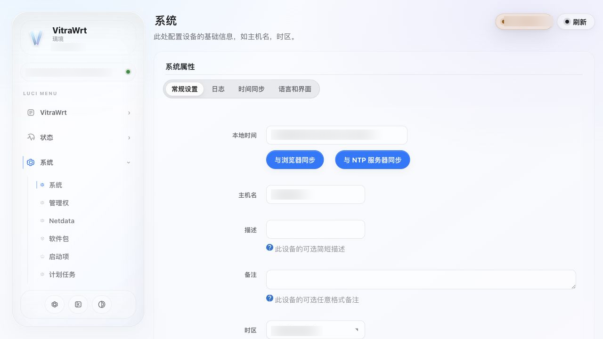
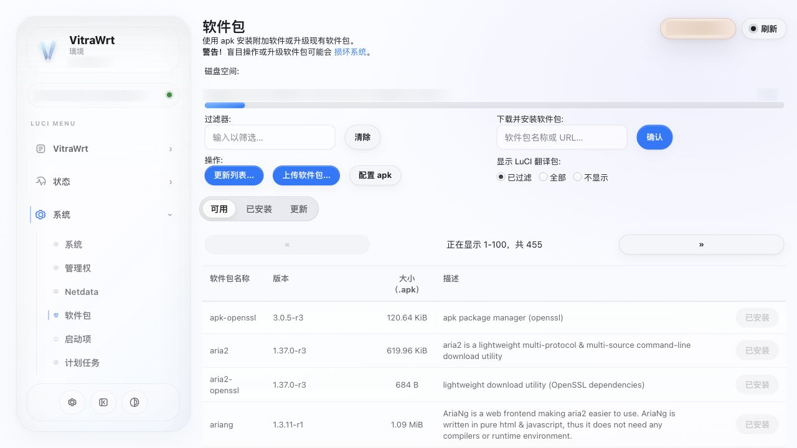
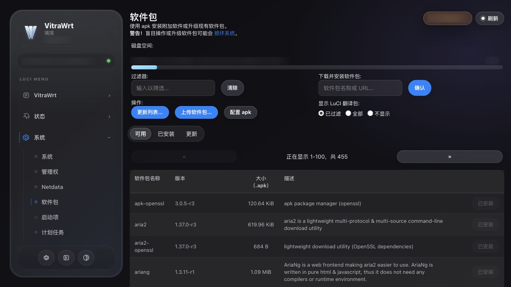
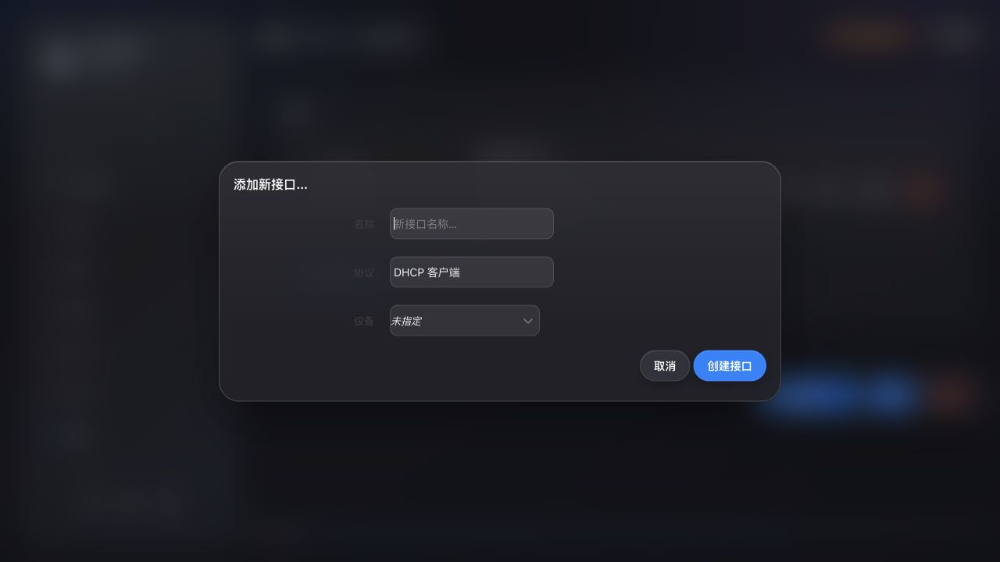

# luci-theme-vitrawrt

VitraWrt / 璃境是一个基于 Vite + TailwindCSS 构建的现代 LuCI 主题，适用于 OpenWrt 与 ImmortalWrt。

## 设计方向

- Apple-inspired flat + dynamic material
- 分层玻璃材质与清晰的内容层级
- 亮色与暗色模式
- 胶囊式控件
- 现代化 LuCI 表单、表格、弹窗与下拉菜单

## 特性

- 使用 Vite + TailwindCSS 构建静态资源
- 不依赖 runtime bridge CSS
- 保持 LuCI 原生页面结构与交互兼容性
- 主题化登录页、侧栏、表单、按钮、表格、下拉菜单、弹窗、加载状态与进度条
- 支持 opkg/ipk 与 apk 包生态

## 截图

| 登录页 | 表单 |
| --- | --- |
|  |  |

| 软件包页面 | 暗色模式 |
| --- | --- |
|  |  |



## 安装

请从 GitHub Releases 下载与设备包管理器匹配的构建产物。

opkg/ipk：

```sh
opkg install /tmp/luci-theme-vitrawrt_1.41.90-r30_all.ipk
```

apk：

```sh
apk add --allow-untrusted /tmp/luci-theme-vitrawrt-1.41.90-r30.apk
```

安装完成后，在 LuCI 的主题设置中选择 `VitraWrt`。必要时清理浏览器缓存并重新登录。

## 从源码构建

先构建前端资源：

```sh
cd frontend
npm install
npm run verify
cd ..
```

构建输出写入：

```text
htdocs/luci-static/vitrawrt/dist/vitrawrt-apple.css
htdocs/luci-static/vitrawrt/dist/vitrawrt-motion.js
```

随后将本仓库放入 OpenWrt 或 ImmortalWrt buildroot 的 package 目录，并执行：

```sh
make package/luci-theme-vitrawrt/{clean,compile} V=s
```

## 兼容性

- OpenWrt / ImmortalWrt LuCI
- opkg/ipk 软件包生态
- apk 软件包生态

不同发行版、LuCI 分支及第三方插件可能存在结构差异，不保证所有第三方 LuCI 插件无需适配即可获得完全一致的视觉效果。

## 范围说明

Dashboard 应用不属于本主题的发布范围，本项目不会修改或替换 Dashboard。主题仅负责 LuCI 外壳与原生组件的视觉呈现。

## License

[Apache License 2.0](LICENSE)
