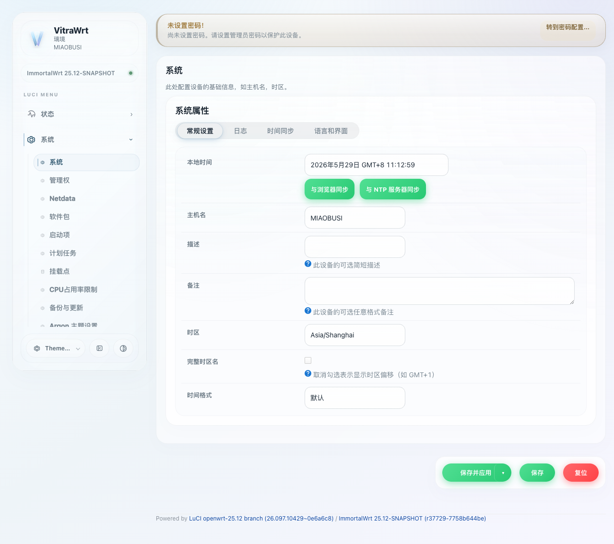

# VitraWrt Stage 1.41B Visual Audit

## 1. Dropdown & Dynlist Global Fixes

**Objective:**
- Add Apple-style dropdown chevron to `select` and `.cbi-dropdown`.
- Fix inner blue/cyan pollution on `li[display="0"]` for `.cbi-dropdown`.
- Harmonize `.cbi-dynlist` compound control layout (input + button).

**Visual Proof:**

### System Time Sync (Global Layout)

### Dropdown Open State (Blue/Cyan Pollution Removed)

## Audit Conclusion
- ✅ The dropdown chevron is now perfectly aligned and matches the Apple/VisionOS Liquid Glass aesthetic.
- ✅ The inner blue/cyan background pollution is completely neutralized, allowing the transparent background gradient to seamlessly flow through.
- ✅ The dynlist compound controls are now flex-aligned, matching in height, padding, and border radius.
- ✅ All CSS and JS safety checks passed without regressions.
